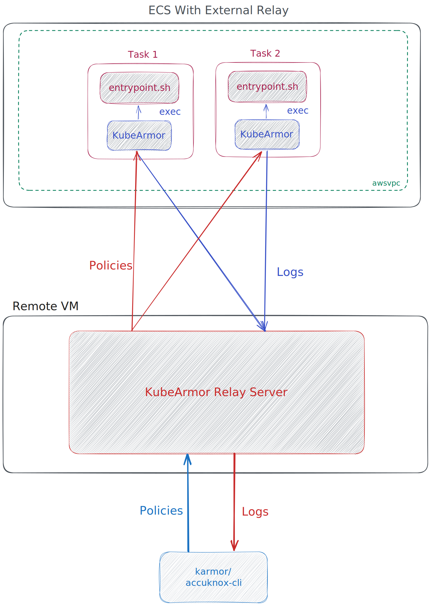

# ECS Fargate
ECS is a managed container service from AWS. Unlike EKS, it isn't based on Kubernetes and thus, the lack of a control plane API makes it difficult to manage orchestration of policies, networking between containers and other such features which KubeArmor generally depends on.

Also, ECS can run on fargate enabled nodes making containers secure but at the same time more difficult to monitor. For instance, it isn't possible to mount container runtime socket in containers running in fargate nodes thus, we can only get limited metadata about the containers.

# Getting started
Create a Fargate enabled ECS cluster by following the [official guide](https://docs.aws.amazon.com/AmazonECS/latest/userguide/create-cluster-console-v2.html).

## Deployment models
There are two deployments models currently supported by KubeArmor with ECS. One deploys KubeArmor Relay Server in a VM outside the ECS cluster and the other deploys it inside the cluster as a task.
* [With Relay deployed externally](#external-relay-deployment)
* [Wtih Relay deployed in-cluster](#in-cluster-relay-deployment)

### External relay deployment

#### Deployment diagram


#### Deploying Relay Server
You can use any bare metal or cloud VM which can run Docker containers to deploy KubeArmor relay-server.

The relay-server is accessed by both the user and KubeArmor. The best approach is to give the VM running relay server a public IP.

To deploy relay-server as a Docker container, run:
```bash
docker run -d --name=kubearmor-relay-server --network=host -e "K8S=false" delusionaloptimist/kubearmor-relay-server:latest
```
This will start the relay and it'll start actively listening for incoming connections for receiving/sending logs and policies.

#### Deploying KubeArmor protected applications on ECS
1. For this demo, we'll be deploying the [sample-task](../examples/ecs/sample-task.json) which creates a reverse shell accessible over port 1337.

    **Specifying command**

    The first part of your command would always need to be path to KubeArmor binary mounted by the shared volume.
    The rest of it will be default commmand.
    ```json
	"command": [
		"kubearmor/bluelock",
		"socat",
		"TCP-LISTEN:1337,reuseaddr,fork",
		"EXEC:bash,pty,stderr,setsid,sigint,sane"
	],
    ```

    **KubeArmor configuration**

    Configuration is specified using environment variables.
    ```json
    "environment": [
		{
			"name": "K8S",
			"value": "false"
		},
		{
			"name": "CONTAINERNAME",
			"value": "armored-container"
		},
		{
			"name": "RELAYSERVERURL",
			"value": "http://<relay-server-host>:<port>"
		}
	],
    ```
    `CONTAINERNAME` is used to match container policies.

    `RELAYSERVERURL` is the public address of the VM running relay-server. This will be used by KubeArmor for sending logs and receiving policies. If no port is specified, port 80 is used. Substitute this value in the sample-task.

    You can follow the [task-template](../deployments/ecs/task-template.json) to create your own task definitions. Some values are intentionally `REDACTED` or enclosed within `<>` as they contain information that user is expected to complete.

    You should also follow the [offical guide](https://docs.aws.amazon.com/AmazonECS/latest/userguide/create-task-definition.html) for creating ECS task definitions according to your needs.

    **IAM**

    A Basic KubeArmor setup should work with the default `taskExecutionRole` IAM permissions granted to all ECS tasks. While creating a new task you have the option to let AWS create it for you. We will be using this role itself for this demo.

    If your application needs access to AWS APIs, you can follow [ECS task execution role guide](https://docs.aws.amazon.com/AmazonECS/latest/developerguide/task_execution_IAM_role.html) to create an IAM role with required permissions and add it to your task as `taskRole`. You can also reference the [sample task role policy](../deployments/ecs/ecs-task-execution-role-policy.json).


2. Once you have created the task defintion, you should deploy it as a service in your ECS cluster.

    Follow [Creating an ECS service using the console](https://docs.aws.amazon.com/AmazonECS/latest/developerguide/create-service-console-v2.html).

    For this demo, our task will need a public IP. Thus, make sure you enable public IP in the network section while creating a service.

    **Note On ServiceConnect**

    ServiceConnect is a networking mode in ECS which injects Envoy proxies and configures ECS ServiceDiscovery for service to service communication. All the ingress and egress traffic goes through these proxies.

    By default Envoy has a setting to timeout inactive connections within 15 seconds and they recommend [disabling](https://www.envoyproxy.io/docs/envoy/latest/faq/configuration/timeouts#route-timeouts) this for workloads which use stream connections. However, currently there is no option provided in ECS to configure the proxies. See [aws/containers-roadmap#1958](https://github.com/aws/containers-roadmap/issues/1958) for reference.
    Thus, this mode does work with KubeArmor but is still not recommended to use until AWS resolves the issues.

    In absence of ServiceConnect, you'll need to setup ServiceDiscovery for your services manually. AWS has removed ServiceDiscovery configuration in the new console and the only way it can be configured while creation is using the [classic console](https://docs.aws.amazon.com/AmazonECS/latest/developerguide/create-service.html).


#### Verifying setup
**Prequisite**
- Install karmor (kubearmor-client) on your system using the [installation steps](https://github.com/kubearmor/kubearmor-client).
- To validate the demo workload, make sure you have socat on your system.

**Creating a reverse shell**

From your cluster's main page, navigate to the task running the demo container and copy the public IP from the Network tab.
On your system create a reverse shell into the application with:
```bash
socat - TCP:<task-ip>:1337
```
You should now be able to execute Linux commands.

**Telemetry logs**

For getting telemetry logs, you can run:
```bash
karmor logs --gRPC=<relay-ip-address>:<port> --logFilter=all
```
Try running some commands in the reverse shell we created earlier, you'll see telemetry logs showing up in karmor's output.

If you want to get only policy alerts remove the `--logFilter` flag.

**Policy enforcement**

A sample policy which enforces on the demo `armored-container` is available at [examples/ecs/sample-block-policy.yaml](../examples/ecs/sample-block-policy.yaml)

If your container is named differently, you'll need to set the selector in policy as the value of `CONTAINERNAME` environment variable set in KubeArmor configuration.
```yaml
  selector:
    matchLabels:
      kubearmor.io/container.name: '<container-name>'
```
You can also set the selector as `*` if you wish to enforce this policy upon all containers.
```yaml
  selector:
    matchLabels:
      kubearmor.io/container.name: '*'
```

Apply the sample policy with:
```bash
karmor vm policy add examples/ecs/sample-block-policy.yaml --gRPC=<relay-ip-address>:<port>
```

For CRUD operations on policies see
```bash
karmor vm policy help
```

### In-Cluster relay deployment
TODO
